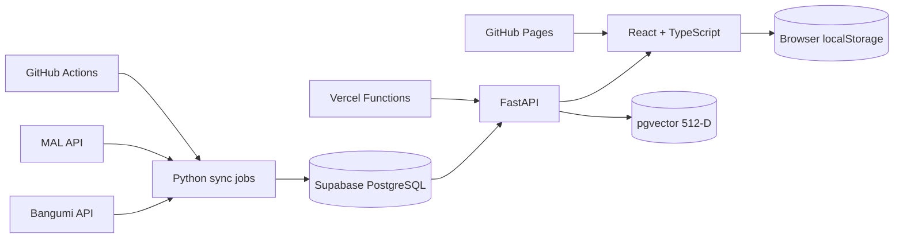

# 番剧示波器 / Anime Oscilloscope

> 多源动画评分采样与分析平台 · Multi-source anime rating sampling and analytics.

[](CHANGELOG.md)
[](docs/verification/phase-10.md)
[](docs/verification/phase-10.md)
[](e2e/critical-flows.spec.ts)
[](LICENSE)

番剧示波器把动画评分视作随时间变化的信号：平台评分是观测值，定时任务负责采样，透明权重负责聚合，来源新鲜度和人数门槛负责解释结果是否可靠。

Anime Oscilloscope treats ratings as time-varying signals. Source scores are observations; sampling, transparent weighting, freshness, and vote thresholds explain how reliable each result is.

## Release status / 发布状态

`v0.8.0` is the first versioned live-data operations release. It keeps the labelled demo fallback for unavailable hosted APIs, while adding observable catalog quality and a protected MAL mapping review queue for live Supabase-backed deployments.

`v0.8.0` 是第一个带正式版本记录的实时数据运维版本：保留清晰标注的演示兜底，同时加入目录质量监控与 MAL 映射人工复核队列。

The public Pages build automatically falls back to the same labelled static demo contract when the hosted API is unavailable. This keeps the portfolio interaction usable without disguising demo records as live data. Set `VITE_DISABLE_DEMO_FALLBACK=true` to make API failure strict.

## Product capabilities / 产品能力

| Capability | Evidence |
|---|---|
| Composite ranking / 综合榜单 | Year, quarter, region, media type, vote thresholds, missing-source completeness |
| Rating oscilloscope / 评分走势 | 87 daily demo snapshots, Bangumi/MAL/composite curves, 12 episode markers |
| Local Tier List / 从夯到拉 | Multiple libraries, drag/drop, ordering, persistence, PNG export |
| Explainable AI search / AI 找番 | Chinese intent parsing, 512-D provider contract, reasons and confidence |
| Private file import / 本地导入 | CSV/JSON parsing in browser, credential rejection, explicit confirmation |
| Quality gates / 质量门禁 | 74 API tests, 23 web tests, 4 Chromium E2E flows |

AI baseline on 50 Chinese queries: Recall@1 `0.94`, Recall@10 `0.98`, mean in-process latency about `0.49 ms`. See [AI evaluation](docs/ai-evaluation.md); these are deterministic fallback metrics, not BGE claims.

## Architecture / 架构



- Frontend: React 19, TypeScript 6, Vite 8
- API: Python 3.12+, FastAPI, Pydantic
- Data design: PostgreSQL, pgvector, forward-only SQL migrations
- AI: optional quantized FastEmbed/BGE provider; deterministic CI fallback
- Delivery: GitHub Actions, GitHub Pages, Vercel Hobby Functions

More detail: [architecture](docs/architecture.md), [data dictionary](docs/data-dictionary.md), [methodology](docs/methodology.md).

## Quick start / 本地运行

```powershell
npm.cmd install
python -m venv .venv
.venv\Scripts\python -m pip install -e "apps/api[dev]"
```

Terminal 1:

```powershell
.venv\Scripts\python -m uvicorn anime_oscilloscope.main:app `
  --app-dir apps/api/src --reload
```

Terminal 2:

```powershell
npm.cmd run dev
```

Open `http://localhost:5173`; API docs are at `http://localhost:8000/docs`.

## Verification / 验证

```powershell
npm.cmd run typecheck
npm.cmd test
npm.cmd run build
.venv\Scripts\python -m ruff check apps/api
.venv\Scripts\python -m pytest apps/api/tests
npm.cmd run test:e2e
.venv\Scripts\python -m anime_oscilloscope.jobs.evaluate_semantic
```

The E2E suite automatically launches the API and web app. Install Chromium once with `npx.cmd playwright install chromium`.

## Optional BGE backend / 可选 BGE 引擎

```powershell
.venv\Scripts\python -m pip install -e "apps/api[ai]"
$env:APP_SEMANTIC_BACKEND="bge"
```

The default CI/demo engine is `hash-512-demo`; API responses disclose the active engine and model. No model download occurs in CI.

## Data and privacy policy / 数据与隐私

- Bangumi and MAL are the first connector contracts; CI uses fixed fixtures, never live APIs.
- Douban and Filmarks remain disabled until written authorization permits reuse.
- NSFW entries and the complete *My Hero Academia* animation franchise are excluded.
- Tier libraries and imported viewing files stay in the browser.
- Password, Cookie, `SESSDATA`, and token fields are rejected.
- Missing source scores are never converted to zero.

See [data sources](docs/data-sources.md) and [Bilibili import decision](docs/bilibili-import.md).

## Portfolio evidence / 作品集证据

- [Chromium demo video](docs/assets/anime-oscilloscope-demo.webm)
- [Codex collaboration case study](docs/codex-collaboration.md)
- [Deployment runbook](docs/deployment.md)
- [Demo script](docs/demo-script.md)
- [Phase verification records](docs/verification)
- Seven phase commits preserve requirements, implementation, tests, and corrections.

## License

Code is released under the [MIT License](LICENSE). Third-party metadata, artwork, names, and trademarks remain the property of their respective owners.
