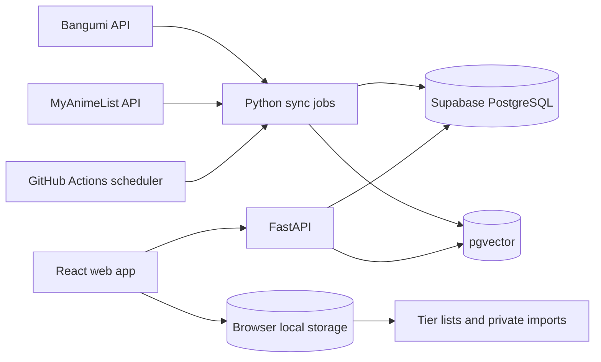

# Architecture

## System map

## Deployment boundaries

- The frontend is a static Vite build deployed to the repository GitHub Pages path.
- The API is a stateless FastAPI service. It reads from PostgreSQL and never stores browser-local Tier List data.
- Scheduled data acquisition runs outside HTTP requests. A source outage cannot erase the last successful snapshot.
- Supabase holds public catalog, mapping, rating, episode, synchronization, and vector data.

## Connector contract

Every rating source will implement the same conceptual operations:

1. discover titles in a date range;
2. fetch canonical metadata or source metadata;
3. fetch current score and rating population;
4. normalize source types and dates;
5. return typed results without writing directly to the database.

Douban and Filmarks connectors remain present as disabled capabilities. No request is made while a connector is disabled.

## Privacy boundary

Tier lists and imported viewing records stay in the browser. If a future Bilibili workflow needs AI review, only unmatched title fragments explicitly approved by the user may be sent to the API. Passwords, cookies, and session credentials are never accepted.
