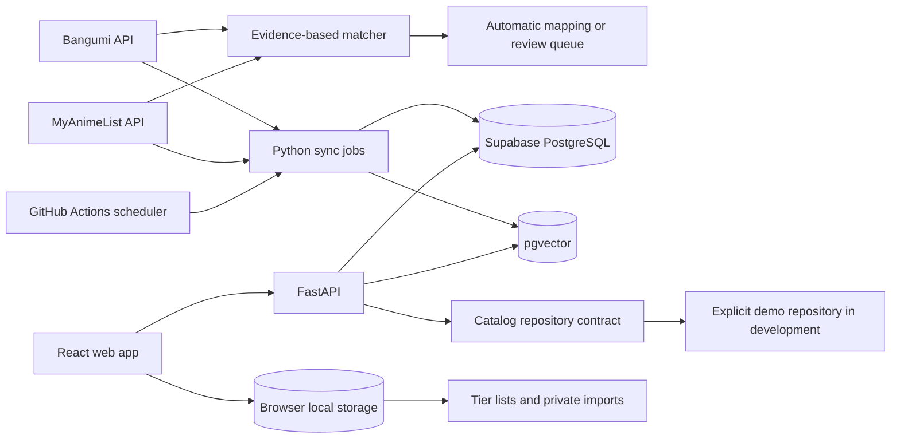

# Architecture

## System map

## Deployment boundaries

- The frontend is a static Vite build deployed to the repository GitHub Pages path.
- The API is a stateless FastAPI service. It reads from PostgreSQL and never stores browser-local Tier List data.
- Scheduled data acquisition runs outside HTTP requests. A source outage cannot erase the last successful snapshot.
- Supabase holds public catalog, mapping, rating, episode, synchronization, and vector data.

## Connector contract

Every rating source will implement the same conceptual operations:

1. discover titles in a date range;
2. fetch canonical metadata or source metadata;
3. fetch current score and rating population;
4. normalize source types and dates;
5. return typed results without writing directly to the database.

Connectors declare capabilities. Bangumi supports episode timelines; MAL does not. Cross-source mapping never invents a missing capability.

## Mapping decisions

The matcher scores title aliases, air-date proximity, media type, and episode count. Installment signatures such as season number, Part, movie, and OVA act as review gates. Automatic mapping is allowed only when confidence is high and no risk reason is present; all other plausible candidates remain versioned review data.

Douban and Filmarks connectors remain present as disabled capabilities. No request is made while a connector is disabled.

## Read model contract

Ranking, search, and detail endpoints depend on a catalog repository rather than directly on a connector. This keeps third-party acquisition separate from public reads and lets fixture/demo data exercise the entire UI without claiming to be live. Every response exposes `data_mode`, source timestamps, source-level observations, missing sources, and completeness.

The composite score is calculated only from available observations. Missing sources are not converted into zero-valued ratings. The default threshold mode requires both Bangumi > 1,000 and MAL > 20,000 votes; unrestricted mode permits single-source entries and labels their completeness.

## Privacy boundary

Tier lists and imported viewing records stay in the browser. If a future Bilibili workflow needs AI review, only unmatched title fragments explicitly approved by the user may be sent to the API. Passwords, cookies, and session credentials are never accepted.
