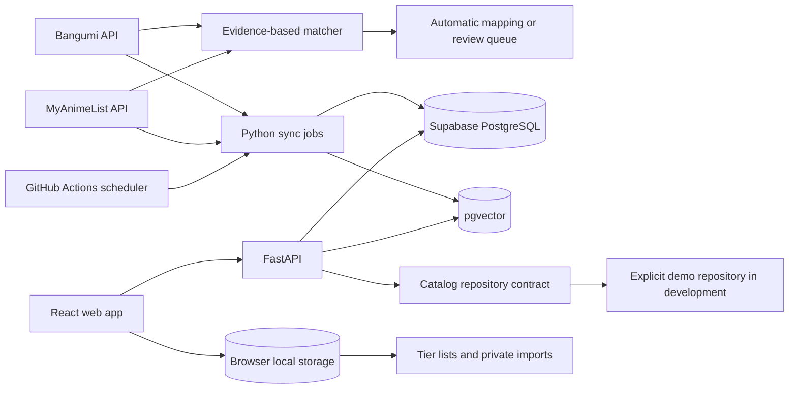

# Architecture

## System map

## Deployment boundaries

- The frontend is a static Vite build deployed to the repository GitHub Pages path.
- The API is a stateless FastAPI service. It reads from PostgreSQL and never stores browser-local Tier List data.
- Scheduled data acquisition runs outside HTTP requests. A source outage cannot erase the last successful snapshot.
- Supabase holds public catalog, mapping, rating, episode, synchronization, and vector data.

## Connector contract

Every rating source will implement the same conceptual operations:

1. discover titles in a date range;
2. fetch canonical metadata or source metadata;
3. fetch current score and rating population;
4. normalize source types and dates;
5. return typed results without writing directly to the database.

Connectors declare capabilities. Bangumi supports episode timelines; MAL does not. Cross-source mapping never invents a missing capability.

## Mapping decisions

The matcher scores title aliases, air-date proximity, media type, and episode count. Installment signatures such as season number, Part, movie, and OVA act as review gates. Automatic mapping is allowed only when confidence is high and no risk reason is present; all other plausible candidates remain versioned review data.

Douban and Filmarks connectors remain present as disabled capabilities. No request is made while a connector is disabled.

## Read model contract

Ranking, search, and detail endpoints depend on a catalog repository rather than directly on a connector. This keeps third-party acquisition separate from public reads and lets fixture/demo data exercise the entire UI without claiming to be live. Every response exposes `data_mode`, source timestamps, source-level observations, missing sources, and completeness.

The composite score is calculated only from available observations. Missing sources are not converted into zero-valued ratings. The default threshold mode requires both Bangumi > 1,000 and MAL > 20,000 votes; unrestricted mode permits single-source entries and labels their completeness.

## Historical sampling

Only titles premiering on or after the tracking launch date enter the historical pipeline. Airing titles are sampled daily. Completed titles move from weekly sampling during the first 90 days, to every 30 days through year three, then every 365 days. Snapshots are retained permanently.

Source acquisition and history reads are failure-isolated. A failed source attempt records its state but does not delete or zero the latest successful snapshot. History responses expose `fresh`, `stale`, or `unavailable` per source, together with the last success and last attempt timestamps. Composite history is calculated independently at each timestamp from the observations actually present.

## Privacy boundary

Tier lists and imported viewing records stay in the browser. If a future Bilibili workflow needs AI review, only unmatched title fragments explicitly approved by the user may be sent to the API. Passwords, cookies, and session credentials are never accepted.

### Tier List local state

Tier libraries use a versioned `localStorage` document. Each library contains ordered arrays for the unranked pool and the five “夯 / 顶 / 人 / 还行 / 拉” tiers. Moving an entry first removes its ID from every location, preventing duplicates, then inserts it at the requested tier and index. Corrupt or incompatible storage safely falls back to a new empty library.

PNG export is rendered directly in the browser with Canvas. It includes only the active library's public catalog fields and never uploads the image or library state.

## Semantic retrieval

Natural-language retrieval combines deterministic constraint parsing with a swappable 512-dimensional embedding provider. The production provider uses FastEmbed's quantized ONNX runtime with `BAAI/bge-small-zh-v1.5`; demo and CI use a deterministic character-ngram vector so tests do not download a model. Every response exposes the actual engine and model name.

Rules extract year, production regions, media type, airing status, and known catalog tags. Structured constraints filter candidates; vector similarity ranks the survivors. Results include rule evidence, similarity evidence, confidence, and elapsed time.

## Private file import

The web client downloads the public catalog index without transmitting private titles. User-selected CSV/JSON files are parsed, deduplicated, and matched to that index in browser memory. Exact, containment, and edit-distance evidence produces up to three candidates. No candidate is added until the user confirms it. Files containing password, Cookie, `SESSDATA`, or token fields are rejected.
